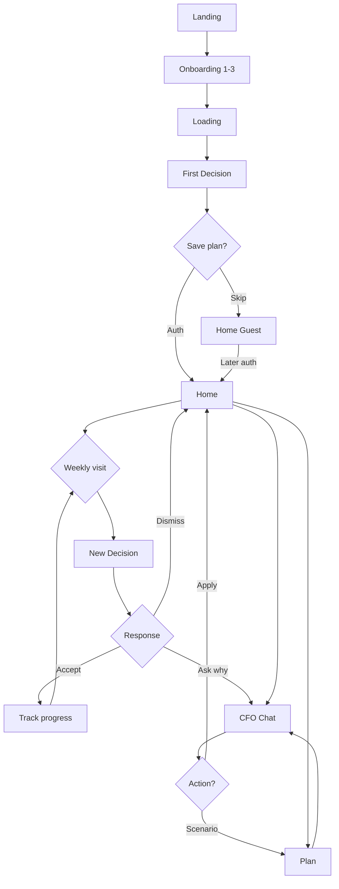

# Velora — Screen Flow

**Phase:** NEXT (Pre-Implementation)  
**Version:** 1.0  
**Scope:** Navigation, user journeys, state transitions  
**Companion docs:** `WIREFRAMES.md` · `COMPONENT_MAP.md`

---

## 1. Application Map

```
                         ┌─────────────┐
                         │   LANDING   │
                         │      /      │
                         └──────┬──────┘
                                │ CTA
                                ▼
┌───────────────────────────────────────────────────────────────┐
│                    ONBOARDING V2 (no nav)                      │
│  /onboarding                                                  │
│  [1 Income] → [2 Dream] → [3 Timeline] → [4 Loading]       │
│         → [5 First Decision] → [6 Save Plan]                  │
└───────────────────────────┬───────────────────────────────────┘
                            │
              ┌─────────────┴─────────────┐
              │                           │
              ▼                           ▼
     [Auth: Google/Email]          [Skip → Guest]
              │                           │
              └─────────────┬─────────────┘
                            ▼
┌───────────────────────────────────────────────────────────────┐
│                 AUTHENTICATED APP (3-tab shell)                │
│                                                               │
│   ┌─────────┐      ┌─────────┐      ┌─────────┐              │
│   │  HOME   │◄────►│   CFO   │◄────►│  PLAN   │              │
│   │  /home  │      │  /cfo   │      │ /plan   │              │
│   └────┬────┘      └────┬────┘      └────┬────┘              │
│        │                │                │                    │
│        └────────────────┼────────────────┘                    │
│                         │                                     │
│                    [Settings]                                 │
│                    /settings                                  │
└───────────────────────────────────────────────────────────────┘

REMOVED FROM NAV (deprecated routes):
  /dashboard  → redirect /home
  /advisor    → redirect /cfo
  /goals      → redirect /plan
  /budget     → demoted (detail panel + CFO only)
```

---

## 2. Entry Points

| Entry | Destination | Condition |
|-------|-------------|-----------|
| Direct URL `/` | Landing | Unauthenticated |
| Direct URL `/home` | Decision Home | Auth or guest with data |
| Direct URL `/home` | Onboarding | No profile data |
| Return visit (auth) | Decision Home | Has account |
| Email weekly brief link | Decision Home | Deep link `#decision` |
| CFO insight tap on Home | `/cfo?prefill=...` | Authenticated |
| Plan scenario chip | Plan sheet → optional `/cfo` | Authenticated |
| Marketing share link | Landing → Onboarding | UTM tracked |

---

## 3. Flow A — First-Time User (Activation)

**Goal:** First decision within 5 minutes. Account after value.

```
START
  │
  ▼
[Landing /]
  │ User reads hook: "האם אתה בדרך הנכונה?"
  │ CTA: "קבל את ההחלטה הראשונה שלך"
  ▼
[Onboarding 1/5 — Income]
  │ Select preset or custom
  │ Validation: income ≥ ₪3,000
  ▼
[Onboarding 2/5 — Life Dream]
  │ Select one goal type
  ▼
[Onboarding 3/5 — Timeline]
  │ Select years + optional custom target
  │ Preview: monthly savings needed
  ▼
[Onboarding 4/5 — Preparing]
  │ Auto-advance after ~3s (min) or when engine ready
  │ API: generate first decision
  ▼
[Onboarding 5/5 — First Decision]  ★ ACTIVATION MOMENT
  │ User reads decision + verdict
  │ CTA: "הבנתי, בוא נתחיל"
  ▼
[Onboarding 6/5 — Save Plan]
  │ Options: Google · Email · Skip
  │
  ├─ Auth success ──► [/home] + welcome toast
  │
  └─ Skip ──────────► [/home] guest mode + banner "שמרי תוכנית"
END
```

**Drop-off recovery:**
- Abandon on step 1–3 → localStorage partial save → resume prompt on return
- Abandon on step 5 → decision cached → show on return before re-onboarding

---

## 4. Flow B — Returning User (Retention)

**Goal:** One decision acted upon per week.

```
START
  │
  ▼
[App open → /home]
  │
  ├─ New weekly decision available
  │     │
  │     ▼
  │   [Decision Hero — pending state]
  │     │ User taps "אני מצטרף/ת"
  │     ▼
  │   [Decision → accepted]
  │     │ Proof loop updated next visit
  │     ▼
  │   [Home — accepted state, muted hero]
  │
  ├─ Proof loop visible
  │     "מאז שבוע שמרת ₪400"
  │
  └─ CFO insight tappable
        │
        ▼
      [/cfo?context=food_spike]
END
```

**Weekly brief email:**
```
Email CTA → /home#decision → scroll to hero
```

---

## 5. Flow C — AI CFO Interaction

**Goal:** Answer → understand → act (without leaving chat when possible).

```
START [/cfo]
  │
  ▼
[Welcome message + suggested chips]
  │
  ├─ User taps chip ──► [Send message] ──► [AI response]
  │
  └─ User types ──────► [Send message] ──► [AI response]
                              │
                              ▼
                    ┌─────────────────┐
                    │ Response types: │
                    ├─────────────────┤
                    │ Plain answer    │
                    │ Answer + inline │
                    │   decision card │
                    │ Answer + action │
                    │   button        │
                    └────────┬────────┘
                             │
              ┌──────────────┼──────────────┐
              ▼              ▼              ▼
        [Continue chat] [Apply decision] [Go to Plan]
              │              │              │
              │              ▼              │
              │         [/home updated]     │
              │                           [/plan scenario]
              ▼
        [Conversation persists]
END
```

**Context prefill from Home:**
```
/home insight tap
  → /cfo?prefill="למה הוצאות המזון עלו?"
  → input pre-filled, auto-focus
```

---

## 6. Flow D — Life Plan & Scenarios

**Goal:** Understand trajectory → simulate → commit to decision.

```
START [/plan]
  │
  ▼
[Primary plan hero — years to goal]
  │
  ├─ Tap scenario chip
  │     ▼
  │   [Bottom sheet — scenario result]
  │     │
  │     ├─ "קבל כהחלטה שבועית" ──► [/home decision updated]
  │     │
  │     └─ "שאל CFO" ──► [/cfo?scenario=...]
  │
  ├─ Tap secondary plan row
  │     ▼
  │   [Expand inline — compact metrics]
  │
  └─ "רוצה לשנות יעד?"
        ▼
      [/cfo] guided conversation (no form)
END
```

---

## 7. Flow E — Decision Response (Home)

**State machine for primary decision:**

```
                    ┌──────────┐
                    │ PENDING  │◄── generated weekly / onboarding
                    └────┬─────┘
                         │
           ┌─────────────┼─────────────┐
           ▼             ▼             ▼
    [אני מצטרף/ת]   [למה?]      [לא עכשיו]
           │             │             │
           ▼             ▼             ▼
    ┌──────────┐   [/cfo prefill]  ┌──────────┐
    │ ACCEPTED │                   │ DISMISSED│
    └────┬─────┘                   └────┬─────┘
         │                              │
         ▼                              ▼
    [Home: proof      ]            [Home: muted hero
     tracking mode  ]             next decision in 7d]
         │
         ▼ (user reports completion — V1)
    ┌──────────┐
    │ COMPLETE │
    └──────────┘
```

---

## 8. Flow F — Guest → Authenticated Migration

```
[Guest completes onboarding]
  │ data in localStorage
  ▼
[Skip auth → /home guest]
  │ banner: "שמרי את התוכנית שלך"
  ▼
[User taps save → auth modal or /onboarding/6]
  ▼
[Auth success]
  ▼
[API: POST /api/profile/merge]
  │ guest localStorage → MongoDB
  ▼
[/home authenticated]
  │ banner dismissed
```

---

## 9. Navigation Matrix

| From \ To | Home | CFO | Plan | Settings | Onboarding |
|-----------|------|-----|------|----------|------------|
| Landing | — | — | — | — | ✓ CTA |
| Home | — | ✓ insight, למה? | ✓ sidebar/rail | ✓ avatar | — |
| CFO | ✓ action applied | — | ✓ scenario | ✓ | — |
| Plan | ✓ set decision | ✓ change goal | — | ✓ | — |
| Bottom nav | ✓ | ✓ | ✓ | — | — |
| Sidebar (desktop) | ✓ | ✓ | ✓ | ✓ bottom | — |

**No direct nav to:** Budget, Goals (legacy), Dashboard (legacy).

---

## 10. Redirect & Deprecation Map

| Legacy route | Action |
|--------------|--------|
| `/dashboard` | 301 → `/home` |
| `/advisor` | 301 → `/cfo` |
| `/goals` | 301 → `/plan` |
| `/budget` | 301 → `/home?details=spending` |

---

## 11. Modal & Overlay Inventory

| Overlay | Trigger | Dismiss |
|---------|---------|---------|
| Scenario bottom sheet | Plan chip tap | Swipe down, tap outside |
| Auth save modal | Guest banner, onboarding 6 | Skip, complete auth |
| Decision "למה?" | Home hero | Navigate to CFO (not modal) |
| Settings drawer | Avatar tap | Tap outside |
| Upgrade prompt (V1) | AI limit hit | Dismiss, continue fallback |

**Rule:** No modal competes with decision hero on Home.

---

## 12. Error & Empty Flows

### No financial data
```
/home → Empty decision card
  → CTA "עדכן נתונים"
  → /settings/finances or inline sheet
  → return /home with new decision
```

### AI unavailable
```
/cfo → User sends message
  → Fallback rule engine response
  → Banner: "מצב לא מקוון — תשובות בסיסיות"
```

### Auth expired
```
Any /home /cfo /plan
  → Redirect /onboarding/6 (save plan)
  → localStorage preserves guest state
```

---

## 13. Notification Touchpoints (V1)

| Channel | Trigger | Deep link |
|---------|---------|-----------|
| Email | Weekly brief | `/home#decision` |
| Push (PWA) | New decision | `/home#decision` |
| Push | Off-track alert | `/home` |
| In-app banner | Guest unsaved plan | Auth modal |

---

## 14. Complete User Journey (Mermaid)



---

## 15. Screen Count Summary

| Category | Screens | Notes |
|----------|---------|-------|
| Marketing | 1 | Landing |
| Onboarding | 6 | Including loading + auth gate |
| Core app | 3 | Home, CFO, Plan |
| Settings | 2–3 | Profile, finances, notifications |
| Overlays | 2 | Scenario sheet, auth |
| **Total MVP** | **~12** | Down from current 7 flat pages + complexity |

---

## 16. Flow Validation Checklist

Before implementation sign-off:

- [ ] Every screen has one primary action
- [ ] User reaches first decision before auth
- [ ] No flow requires visiting budget page
- [ ] CFO reachable from every core screen in ≤2 taps
- [ ] Back button behavior defined for onboarding (step back, not browser back escape)
- [ ] Guest and auth states visually identical except save banner
- [ ] All legacy URLs redirect

---

*End of Screen Flow — see WIREFRAMES.md and COMPONENT_MAP.md*
